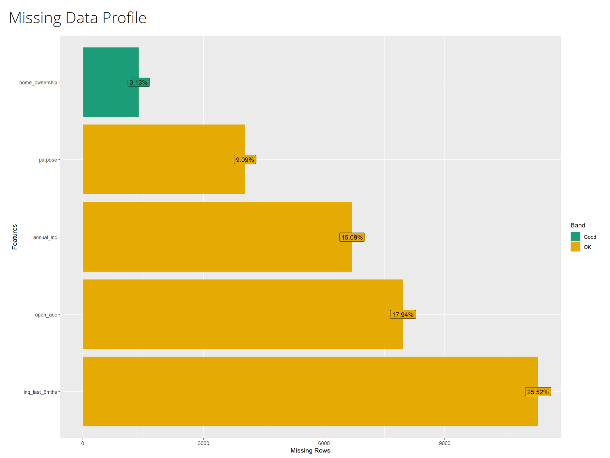

## Introduction

In this project, we explore the pre-processing step of data wrangling. We do this using dplyr and tidyr. Real-world datasets often are filled with missing values and anomalies. When performing calculations on these dataset this may result in problems. Therefore we first have to perform automated Exploratory Data Analysis (EDA) using the DataExplorer package. This will help to establish an overview of the missing data. Subsequently, we manually wrangle the data to identify and quantify the "dirty" values. We consider empty strings, spaces, NaN values and statistical outliers across all categorical and numerical attributes as dirty values.

The goal is to assess the dataset's quality to inform future data cleaning decisions.

### Package installation

```{r}
# Check for missing packages, install them if necessary,
# and load them into the environment.
if (!require(dplyr)) install.packages("dplyr")
if (!require(tidyr)) install.packages("tidyr")
if (!require(data.table)) install.packages("data.table")
if (!require(DataExplorer)) install.packages("DataExplorer")
if (!require(ggplot2)) install.packages("ggplot2")

library(dplyr)
library(ggplot2)
library(tidyr)
library(data.table)
library(DataExplorer)
```

## Task 1: Exploratory Data Analysis

We begin by loading our private dataset, `myLCdata`, and applying a custom `dirtify` function using our group ID to introduce the anomalies. We then generate an automated EDA report using `DataExplorer::create_report()`. @fig-missing-data-profile displays the "Missing Data Profile" generated by this report. This profile primarily highlights standard `NA` values, revealing that the `home_ownership` feature is the most complete and categorized as "good". However, this automated tool does not capture the full extent of the hidden special strings, necessitating our manual wrangling step.

```{r}
# Load the private dataset
myLCdata <- fread("myLCdata.csv")

# Apply the dirtyfy function using our group ID (3)
dirtify <- readRDS(file = "dirtyfy.rds")
myLCdata_dirty <- dirtify(myLCdata, 3)

# Executing the DataExplorer::create_report() 
# on the dirtified myLCdata in the console
# create_report(myLCdata_dirty)
```

### Result from DataExplorer::create_report()

{#fig-missing-data-profile width="608"}

## Task 2: Data Wrangling and Visualization

```{r}
glimpse(myLCdata_dirty)
str(myLCdata_dirty)

summary(myLCdata_dirty)
```



| Variable       | Explanation |
|----------------|-------------|
| annual_inc     | numerical   |
| open_acc       | numerical   |
| purpose        | categorical |
| home_ownership | categorical |
| inq_last_6mths | numerical   |

: Explanation of the variables (categorical or numeric)

Empty categorical features can contain the following values:

-   **`NA` or Not Available:** Indicates missing values that R recognizes as missing.
-   **The string `"n/a"`:** We pretend this string was used in the source data set to indicate missing data. Since it is a string R does not recognize it as missing.
-   **A space `" "`:** Another special string.
-   **The empty string `""`:** Another special string.

Empty numerical features can contain the following values:

-   **`NA`:** Standard missing values.
-   **`NaN` or Not a Number:** Results from invalid computations such as 0/0.
-   **Outliers:** These were actually not ingested but already present in the data. There is no rigid mathematical definition of what constitutes an outlier. In this task we use Tukey's fences. We count values as outliers if they lie outside the whiskers of the boxplot.

### Overall NA per feature

```{r}
myLCdata_dirty %>% summarise(across(everything(), ~sum(is.na(.))))
```

### Categorical features (purpose, home_ownership)

For our categorical variables (`purpose` and `home_ownership`), we calculate the relative frequencies of various missing data representations. As seen in @fig-categorical, the data contains standard `NA`s, which R natively recognizes as missing. During a future cleaning phase, we would need to decide whether to impute these values or remove the affected rows or columns. We also identified hidden missing data disguised as `"n/a"` strings, empty strings, and spaces. Notably, spaces may or may not truly indicate missing data, and text strings like `"n/a"` must be explicitly transformed into `NA` for R to process them correctly.

```{r}
#| label: fig-categorical
#| fig-cap: "Percentage of special values in the categorical attributes of myLCdata"

# Calculate percentages for all categorical columns dynamically
myLCdata_dirty_values_categorical <- myLCdata_dirty %>%
  select(purpose, home_ownership) %>%
  pivot_longer(cols = everything(), 
               names_to = "columns", 
               values_to = "empty_value") %>%
  filter(if_any(everything(), ~ . %in% c(" ", "", "n/a") | is.na(.))) %>%
  mutate(empty_value = case_when(
    empty_value == "" ~ "empty_string",
    empty_value == " " ~ "single_space",
    is.na(empty_value) ~ "NA_value",
    empty_value == "n/a" ~ "n/a"
  )) %>%
  group_by(columns, empty_value) %>% summarise(dirty_value_count = n()) %>%
  pivot_wider(names_from = empty_value, 
              values_from=dirty_value_count, 
              names_prefix = "percentage_") %>% 
  mutate(across(where(is.numeric), ~. / nrow(myLCdata_dirty)))

head(myLCdata_dirty_values_categorical)

# Plotting the categorical data
ggplot_data_categorical <- myLCdata_dirty_values_categorical %>% 
  pivot_longer(cols=-columns, 
               names_to = "empty_value", 
               values_to = "proportion")

ggplot(ggplot_data_categorical) +
  geom_col(aes(x = columns, y = proportion)) +
  coord_flip() + 
  scale_y_continuous(labels = scales::percent) +
  facet_wrap(~empty_value, ncol = 1) +
  labs(y = "Proportional distribution", x = "Categorical attribute")
```

```         
```

### **Numerical Features**

We also evaluate our numerical attributes (`annual_inc`, `open_acc`, `inq_last_6mths`) for anomalies. @fig-numerical details the proportion of standard `NA`s, `NaN`s resulting from invalid computations, and statistical outliers. Outliers were identified using Tukey's fences, meaning any value falling outside the whiskers of a standard boxplot was counted. While these outliers will need to be inspected closely during data cleaning to determine if they are errors or valuable edge cases (such as a medical anomaly in healthcare data), `NaN`s will likely need to be corrected or treated as standard missing values.

```{r}
#| label: fig-numerical
#| fig-cap: "Percentage of special values in the numerical attributes of myLCdata"

# Calculate percentages for all numerical columns dynamically
analysis_missing_numeric <- myLCdata_dirty %>%
  summarise(
    across(
      where(is.numeric),
      list(
        perc_NA = ~ sum(is.na(.) & !is.nan(.)) / n(),
        perc_NaN = ~ sum(is.nan(.)) / n(),
        perc_outliers = ~ length(boxplot.stats(.)$out) / n()
      )
    )
  ) %>%
  pivot_longer(
    cols = everything(),
    names_to = c("attribute", ".value"),
    names_pattern = "(.*)_(perc_.*)"
  )

head(analysis_missing_numeric)

# Plotting the numerical data
ggplot_data_numeric <- analysis_missing_numeric %>%
  pivot_longer(cols = -attribute, names_to = "type", values_to = "proportion")

ggplot(ggplot_data_numeric) + 
  geom_col(aes(x = attribute, y = proportion)) + 
  coord_flip() +
  scale_y_continuous(labels = scales::percent) +
  facet_wrap(~type, ncol = 1) +
  labs(y = "Proportional distribution", x = "Numerical attribute")
```

**Conclusion**

Our manual data wrangling successfully revealed the true extent of inconsistencies within the `myLCdata_dirty` dataset. While the automated `DataExplorer` report gave us a baseline understanding of standard missing values, our `dplyr` and `tidyr` operations uncovered a significant amount of hidden "dirty" data, such as `"n/a"` text strings and empty spaces. Furthermore, applying Tukey's fences allowed us to systematically isolate outliers across all numeric variables. This comprehensive overview of the dataset's flaws provides the necessary groundwork for the subsequent formal data cleaning phase, where we will decide how to impute, correct, or remove these anomalies to ensure accurate future analyses.
